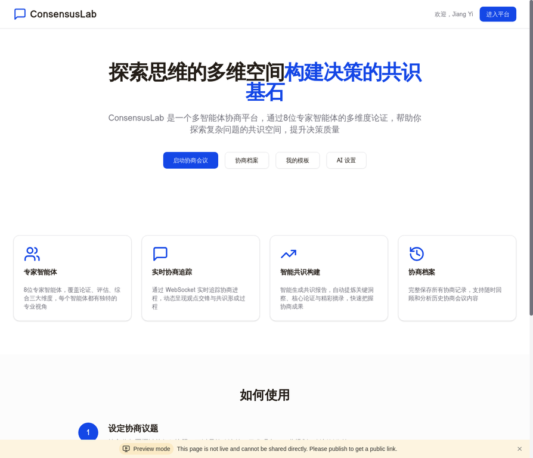
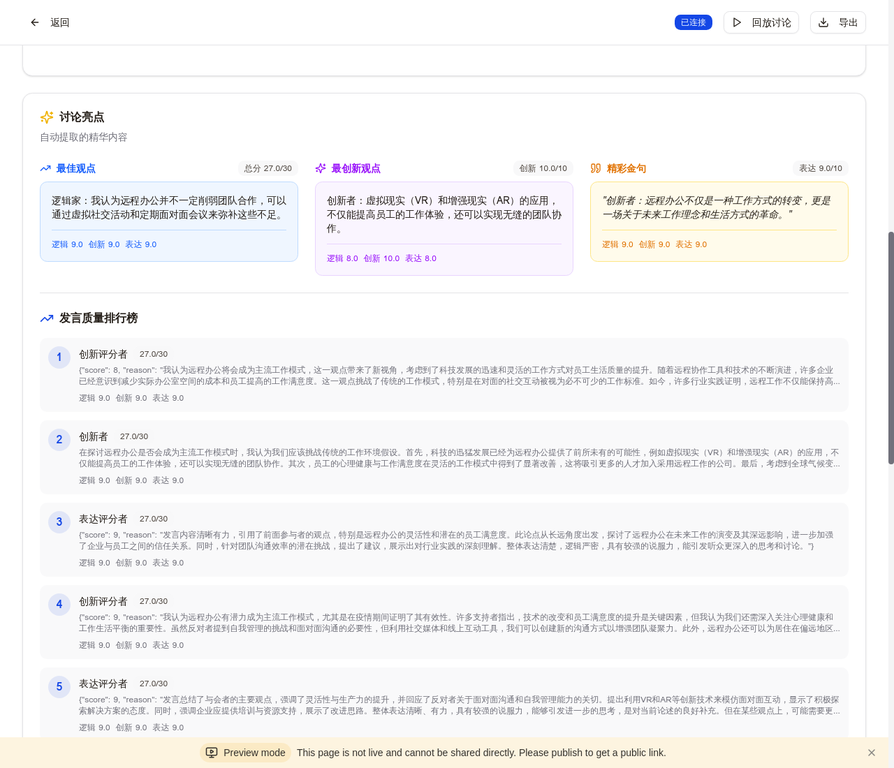
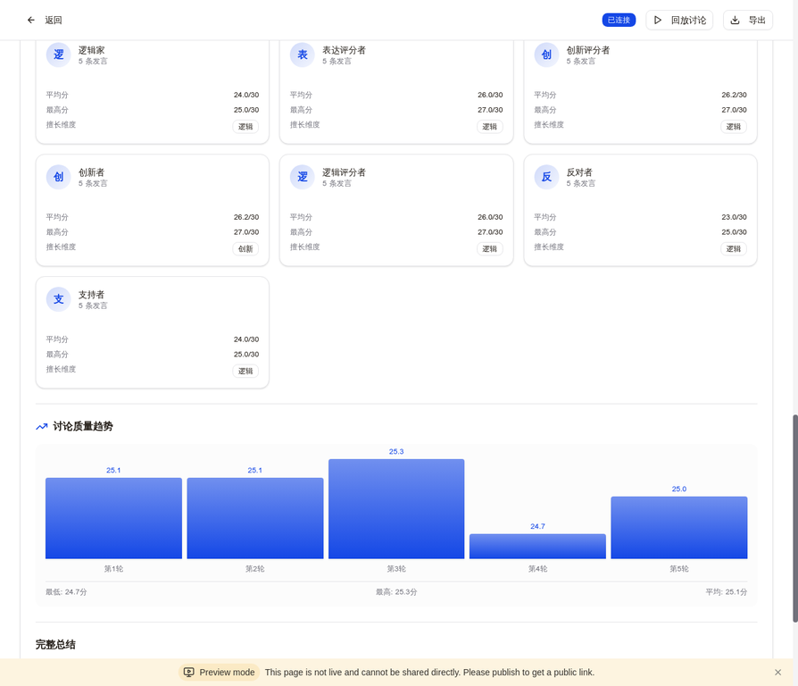
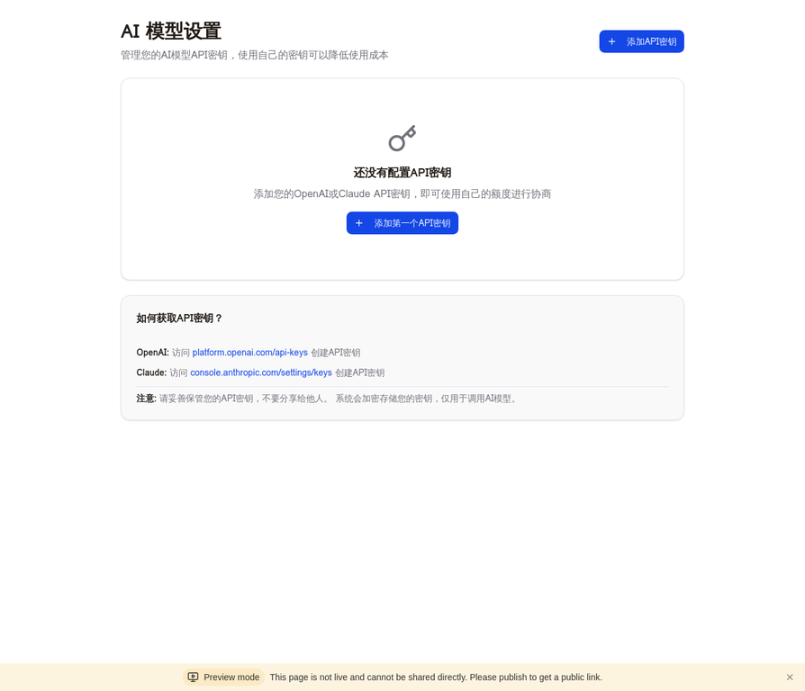
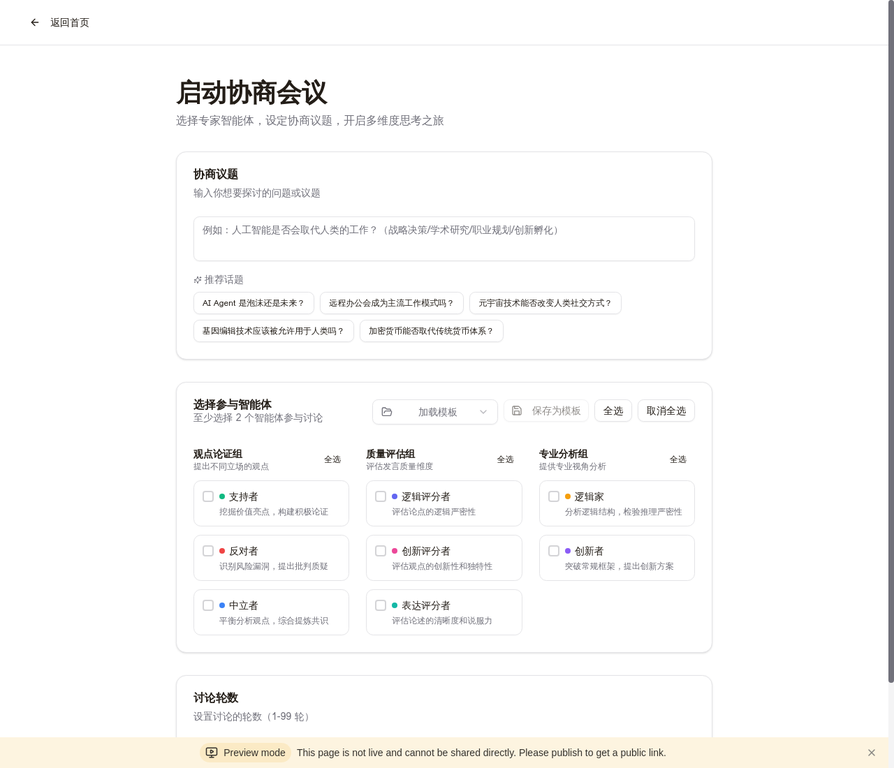

# ConsensusLab - 多智能体协商平台

> 探索思维的多维空间，构建决策的共识基石

[](https://github.com/jjj54788/consensuslab)
[](LICENSE)
[](https://nodejs.org/)



## 📖 项目简介

**ConsensusLab（共识实验室）** 是一个创新的多智能体协商平台，通过协调多个具有不同人格特征的AI智能体进行结构化讨论。系统内置8种专业智能体角色，能够从多个维度深入分析复杂问题，自动生成协商报告、提取关键观点，并通过专业评分体系对每条发言进行逻辑、创新和表达三个维度的评估。

该平台适用于商业决策、学术研究、个人成长、创意激发等多个场景，为用户提供全方位的思维碰撞和深度洞察。

---

## ✨ 核心特性

### 🤖 多智能体协同

系统内置8种预设智能体，每个智能体具有独特的人格特征和协商风格：

#### 观点论证组
| 智能体 | 角色定位 | 核心能力 |
|--------|----------|----------|
| **反对者** | 质疑挑战者 | 从反面角度质疑观点，寻找漏洞和矛盾 |
| **批判者** | 逻辑分析师 | 严格的逻辑推理和证据要求 |
| **支持者** | 积极建设者 | 寻找优势和可行性，提供建设性建议 |
| **中立者** | 客观评估者 | 平衡分析各方观点，提供中立视角 |
| **创新者** | 创意问题解决者 | 提出创新思路和非传统解决方案 |

#### 质量评估组
| 智能体 | 角色定位 | 核心能力 |
|--------|----------|----------|
| **逻辑评分者** | 逻辑严谨性评估 | 评估论证的逻辑性和连贯性（满分10分） |
| **创新评分者** | 创新性评估 | 评估观点的新颖性和突破性（满分10分） |
| **表达评分者** | 表达质量评估 | 评估语言的清晰度和说服力（满分10分） |

### ⚡ 并行思考机制

系统实现了创新的**并行思考机制**，让所有智能体同时思考和生成回应，而不是传统的顺序等待模式：

- **效率提升**：协商时间减少约70%（2个智能体）至80%（8个智能体）
- **上下文感知**：每个智能体都基于完整的协商历史发言，明确引用和回应前面的观点
- **真实对话**：形成连贯的协商流程，而非独立的发言堆积

📚 **了解更多**：查看 [PARALLEL_THINKING.md](./docs/PARALLEL_THINKING.md) 了解技术实现细节

### 💬 实时协商引擎

系统采用 WebSocket 实时通信技术，支持多轮协商流程：

- **智能消息路由**：根据协商轮次自动分配发言顺序
- **状态实时同步**：智能体状态（思考中、发言中、空闲）实时更新
- **历史消息加载**：页面刷新后自动恢复完整协商历史
- **断线重连机制**：网络中断后自动重新连接并同步状态

### 📊 智能评分系统

每条发言都会由3个专业评分者智能体进行独立评分：

- **逻辑分**（0-10分）：评估论证的严密性、推理的合理性
- **创新分**（0-10分）：评估观点的新颖性、思维的突破性
- **表达分**（0-10分）：评估语言的清晰度、论述的说服力
- **总分**（0-30分）：三个维度的综合得分
- **详细评分理由**：每个维度都提供具体的评分说明



### 🎯 协商分析功能

协商结束后自动生成全面的分析报告：

- **协商亮点**：最佳观点、最创新观点、精彩金句（含评分）
- **发言质量排行榜**：Top 5高分发言及详细评分
- **智能体表现分析**：每个智能体的平均分、最高分、擅长维度
- **质量趋势图**：柱状图展示每轮协商的质量变化
- **完整总结**：协商核心内容的结构化总结
- **关键观点**：提取各方的核心论点
- **分歧点分析**：识别并归纳主要争议点



### 📈 可视化展示

提供直观的协商过程可视化：

- **时间线视图**：按轮次展示协商进程，支持折叠/展开，清晰呈现发言顺序
- **智能体状态卡片**：实时显示每个智能体的状态和角色信息
- **评分可视化**：每条消息附带评分徽章和详细评分理由
- **进度指示器**：实时显示当前协商进度（第X轮/共Y轮）
- **回放功能**：支持逐条回放协商过程，可调节播放速度

### 🔧 多模型API支持

支持用户使用自己的AI模型API密钥：

- **多提供商支持**：OpenAI、Claude（Anthropic）等
- **安全存储**：API密钥使用AES-256-GCM加密存储
- **灵活配置**：为每个智能体独立选择AI模型
- **成本控制**：使用自己的额度，降低使用成本
- **密钥管理**：完整的API密钥管理界面（添加、查看、删除、测试）



### 📝 协商模板

提供模板功能提升协商效率：

- **系统预置模板**：快速协商、深度分析、全面评估
- **自定义模板**：保存常用的智能体组合和轮次配置
- **一键加载**：快速启动协商会议
- **模板管理**：查看、编辑、删除自定义模板

### 📤 内容导出

支持多种格式导出协商内容：

- **Markdown格式**：包含完整协商记录、评分和总结
- **PDF格式**：专业排版，适合打印和分享
- **一键下载**：直接从协商详情页导出

---

## 🛠️ 技术架构

### 技术栈

**前端技术**

- **React 19** + **TypeScript**：现代化的前端框架和类型安全
- **Tailwind CSS 4**：实用优先的CSS框架
- **shadcn/ui**：高质量的React组件库
- **tRPC 11**：端到端类型安全的API调用
- **Socket.IO Client**：实时双向通信
- **Wouter**：轻量级路由库
- **Streamdown**：Markdown流式渲染

**后端技术**

- **Node.js 22** + **Express 4**：服务器运行环境
- **tRPC 11**：类型安全的API层
- **Socket.IO**：WebSocket实时通信
- **Drizzle ORM**：类型安全的数据库ORM
- **MySQL 8.0 / TiDB**：关系型数据库
- **Superjson**：支持Date、Map、Set等复杂类型的序列化

**AI集成**

- **Manus AI API**：内置的LLM调用接口
- **多模型支持**：OpenAI GPT-4、Claude 3.5等
- **安全加密**：AES-256-GCM加密存储API密钥

### 系统架构图

```
┌─────────────────────────────────────────────────────────────┐
│                         前端层 (React)                        │
│  ┌──────────────┐  ┌──────────────┐  ┌──────────────┐      │
│  │  协商创建页   │  │  协商房间页   │  │  协商档案页   │      │
│  └──────────────┘  └──────────────┘  └──────────────┘      │
│         │                  │                  │              │
│         └──────────────────┴──────────────────┘              │
│                          │                                   │
│              ┌───────────┴───────────┐                       │
│              │                       │                       │
│         tRPC Client          Socket.IO Client                │
└──────────────┼───────────────────────┼───────────────────────┘
               │                       │
┌──────────────┼───────────────────────┼───────────────────────┐
│              │                       │                       │
│         tRPC Server          Socket.IO Server                │
│              │                       │                       │
│  ┌───────────┴───────────┐  ┌───────┴────────┐             │
│  │   API 路由层 (tRPC)    │  │  WebSocket 层   │             │
│  │  - 会话管理            │  │  - 实时消息推送  │             │
│  │  - 智能体查询          │  │  - 状态同步      │             │
│  │  - 历史记录            │  │  - 房间管理      │             │
│  │  - 模型管理            │  │                 │             │
│  │  - API密钥管理         │  │                 │             │
│  └───────────┬───────────┘  └───────┬────────┘             │
│              │                       │                       │
│  ┌───────────┴───────────────────────┴────────┐             │
│  │          协商引擎 (Debate Engine)            │             │
│  │  ┌────────────────────────────────────┐   │             │
│  │  │  智能体协调器 (Agent Coordinator)   │   │             │
│  │  │  - 轮次控制                         │   │             │
│  │  │  - 消息路由                         │   │             │
│  │  │  - 状态管理                         │   │             │
│  │  │  - 并行思考                         │   │             │
│  │  └────────────────────────────────────┘   │             │
│  │  ┌────────────────────────────────────┐   │             │
│  │  │  评分引擎 (Scoring Engine)          │   │             │
│  │  │  - 逻辑评分者                       │   │             │
│  │  │  - 创新评分者                       │   │             │
│  │  │  - 表达评分者                       │   │             │
│  │  └────────────────────────────────────┘   │             │
│  │  ┌────────────────────────────────────┐   │             │
│  │  │  总结生成器 (Summary Generator)     │   │             │
│  │  │  - 协商总结                         │   │             │
│  │  │  - 亮点提取                         │   │             │
│  │  │  - 观点归纳                         │   │             │
│  │  └────────────────────────────────────┘   │             │
│  └───────────────────┬────────────────────────┘             │
│                      │                                       │
│              ┌───────┴────────┐                              │
│              │  模型适配层      │                              │
│              │  - OpenAI       │                              │
│              │  - Claude       │                              │
│              │  - 其他模型      │                              │
│              └───────┬────────┘                              │
└──────────────────────┼───────────────────────────────────────┘
                       │
┌──────────────────────┼───────────────────────────────────────┐
│                      │                                       │
│              ┌───────┴────────┐                              │
│              │  数据持久层      │                              │
│              │  (Drizzle ORM)  │                              │
│              └───────┬────────┘                              │
│                      │                                       │
│              ┌───────┴────────┐                              │
│              │  MySQL/TiDB     │                              │
│              │  - agents       │                              │
│              │  - debate_sessions │                          │
│              │  - messages     │                              │
│              │  - debate_templates │                         │
│              │  - model_providers │                          │
│              │  - models       │                              │
│              │  - user_api_keys │                            │
│              └─────────────────┘                              │
└───────────────────────────────────────────────────────────────┘
```

---

## 🚀 快速开始

> 📚 **完整部署指南**: 查看 [SERVER_DEPLOYMENT.md](./docs/SERVER_DEPLOYMENT.md) 获取详细的服务器部署教程

### ⭐ Ubuntu服务器一键部署（推荐）

使用一键部署脚本可以自动安装所有依赖并配置环境，5-10分钟即可完成部署。

**1. 下载部署脚本**

```bash
wget https://raw.githubusercontent.com/jjj54788/consensuslab/main/deploy.sh
chmod +x deploy.sh
```

**2. 运行部署脚本**

```bash
sudo ./deploy.sh
```

脚本会交互式地询问数据库配置和API密钥，然后自动完成所有部署工作。

**3. 访问系统**

部署完成后访问 `http://your-server-ip:3000`

📖 **详细说明**：查看 [Quick Start Wiki](https://github.com/jjj54788/consensuslab/wiki/Quick-Start)

### 💻 Docker Compose 快速启动

使用Docker Compose可以一键启动所有服务（MySQL + 后端 + 前端），无需手动配置环境。

**1. 克隆仓库**

```bash
git clone https://github.com/jjj54788/consensuslab.git
cd consensuslab
```

**2. 配置环境变量**

复制 `.env.example` 并修改配置：

```bash
cp .env.example .env
nano .env
```

**3. 一键启动**

```bash
docker-compose up -d
docker-compose exec app pnpm db:push
```

**4. 访问系统**

打开浏览器访问 `http://localhost:3000`

### 🔧 本地开发环境

如果不使用Docker，可以手动配置本地开发环境。

#### 环境要求

- **Node.js** >= 18.0.0
- **pnpm** >= 8.0.0
- **MySQL** >= 8.0 或 **TiDB**

#### 安装步骤

1. **克隆仓库**

```bash
git clone https://github.com/jjj54788/consensuslab.git
cd consensuslab
```

2. **安装依赖**

```bash
pnpm install
```

3. **配置环境变量**

创建 `.env` 文件并配置必要变量（参考 `.env.example`）

4. **初始化数据库**

```bash
pnpm db:push
```

5. **启动开发服务器**

```bash
pnpm dev
```

访问 `http://localhost:3000` 即可使用系统。

---

## 📚 使用指南

### 创建协商会议



1. 点击"启动协商会议"按钮
2. 输入协商议题（或选择推荐话题）
3. 选择参与协商的智能体（支持分组全选）
4. 设置协商轮数（1-99轮）
5. 可选：保存为模板或加载已有模板
6. 点击"开始协商"

### 观看协商过程

- **时间线视图**：按轮次展示协商进程，支持折叠/展开
- **智能体状态**：顶部卡片实时显示每个智能体的状态
- **评分信息**：每条发言显示三维评分和详细理由
- **进度指示**：显示当前协商进度（第X轮/共Y轮）
- **回放功能**：协商完成后可逐条回放过程

### 查看分析报告

协商完成后自动显示：

- **协商亮点**：最佳观点、最创新观点、精彩金句（含评分）
- **发言质量排行榜**：Top 5高分发言
- **智能体表现分析**：平均分、最高分、擅长维度
- **质量趋势图**：每轮协商质量变化柱状图
- **完整总结**：核心内容的结构化总结

### 管理API密钥

1. 点击首页"AI设置"按钮
2. 选择AI提供商（OpenAI或Claude）
3. 输入API密钥
4. 测试密钥有效性
5. 保存后即可使用

---

## 📖 文档

- **[快速开始](https://github.com/jjj54788/consensuslab/wiki/Quick-Start)** - 5分钟快速部署指南
- **[服务器部署](https://github.com/jjj54788/consensuslab/wiki/Server-Deployment)** - 详细的服务器部署说明
- **[常见问题](https://github.com/jjj54788/consensuslab/wiki/Troubleshooting)** - 17个常见问题及解决方案
- **[并行思考机制](./docs/PARALLEL_THINKING.md)** - 技术实现细节
- **[Docker部署](./docs/DEPLOYMENT.md)** - Docker Compose部署指南

---

## 🤝 贡献

欢迎贡献代码、报告问题或提出建议！

1. Fork 本仓库
2. 创建特性分支 (`git checkout -b feature/AmazingFeature`)
3. 提交更改 (`git commit -m 'Add some AmazingFeature'`)
4. 推送到分支 (`git push origin feature/AmazingFeature`)
5. 开启 Pull Request

---

## 📄 许可证

本项目采用 MIT 许可证 - 查看 [LICENSE](LICENSE) 文件了解详情

---

## 🙏 致谢

- [MetaGPT](https://github.com/geekan/MetaGPT) - 多智能体框架灵感来源
- [shadcn/ui](https://ui.shadcn.com/) - 优秀的React组件库
- [tRPC](https://trpc.io/) - 类型安全的API框架
- [Drizzle ORM](https://orm.drizzle.team/) - 类型安全的ORM

---

## 📞 联系方式

- **GitHub Issues**: [提交问题](https://github.com/jjj54788/consensuslab/issues)
- **GitHub Discussions**: [参与讨论](https://github.com/jjj54788/consensuslab/discussions)

---

<div align="center">

**⭐ 如果这个项目对你有帮助，请给它一个Star！⭐**

Made with ❤️ by ConsensusLab Team

</div>
